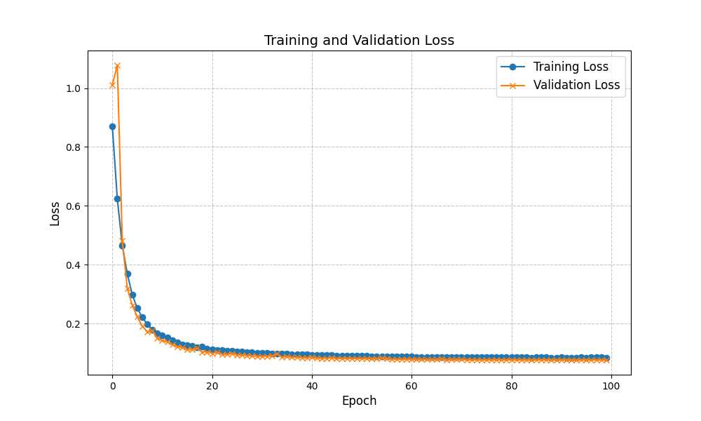

# Lung Segmentation

### Lung Segmentation On Chest Xray Images

### Models

- [x] UNET++
- [-] YOLOv8
- [-] YOLOv11

### Training Results
#### UNET++

#### YOLOv11
#### YOLOv8

### Dataset

The dataset I used is [1](https://www.kaggle.com/datasets/iamtapendu/chest-x-ray-lungs-segmentation)

### Use Streamlit Demo UI
